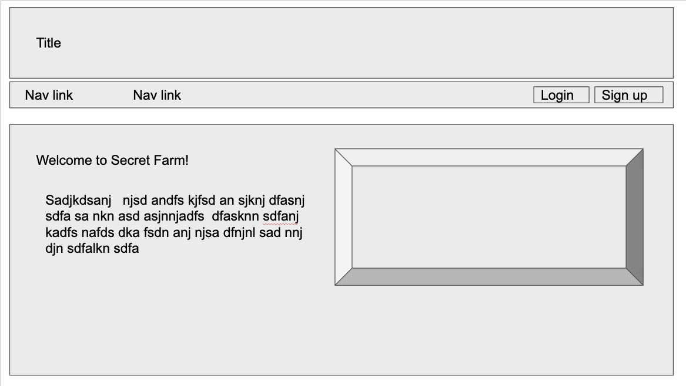
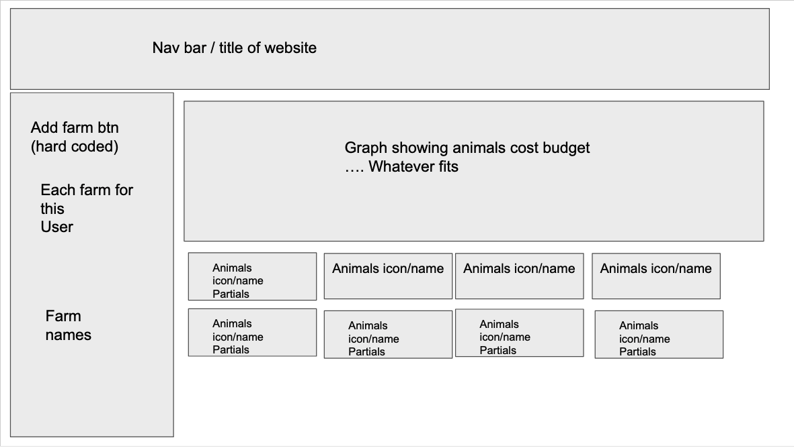
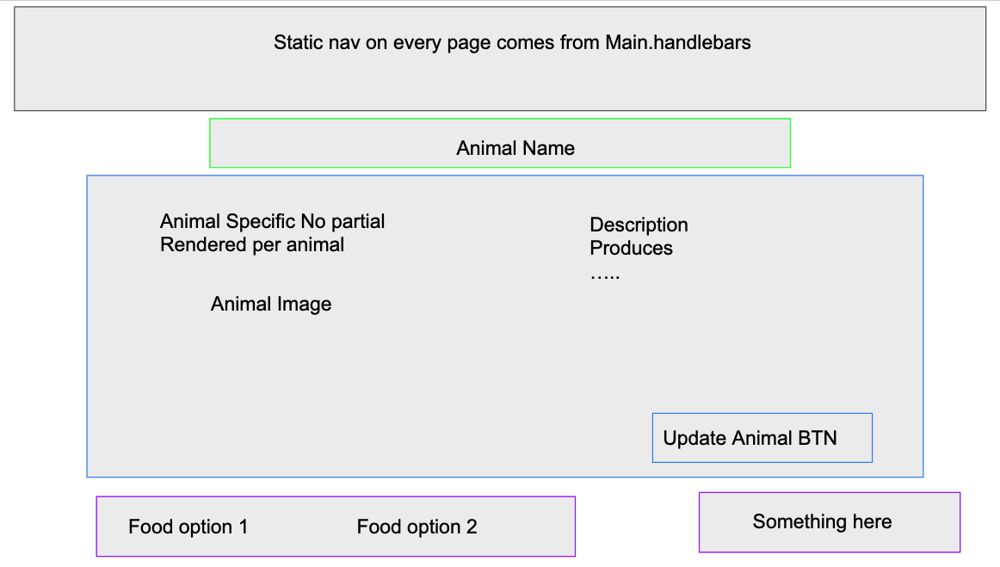
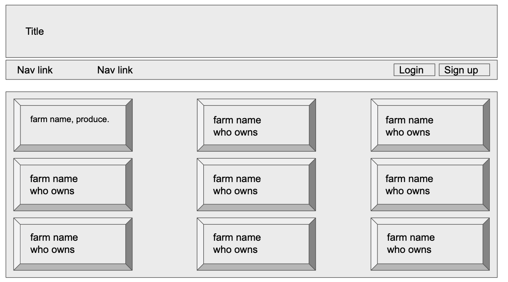

# Design Artifacts

## (view the [main prototype](https://lshillman.github.io/secret-farm))

OnlyFarms started as an attempt to make a gardening simulator game, where you'd try to protect your garden veggies from your marauding chickens. That idea ultimately didn't work out, but we salvaged the database models we made for the game to build the current farm budgeting app.

We started with a high-level brainstorm of what we wanted to accomplish, and collaboratively wireframed in Google Slides. It was pretty rough:

## Original concept wireframes

## Refinement

With the wireframes complete, we refined them into designs we could actually implement. It was easiest to prototype some of the interactions as well.

As we worked through our tasks, we kept updating the prototype so we had a source of truth to work from. This proved essential for a group of four developers trying to get an MVP out the door in under a week.

View the main prototype [here](https://lshillman.github.io/secret-farm). Note that it is somewhat interactive; you can click things and fill out forms to see things like validation behavior.